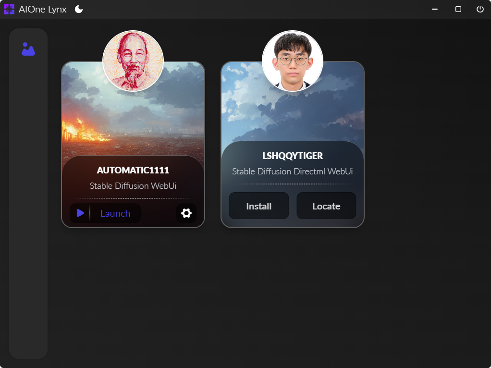

 <h1>AIOne Lynx</h1>

<picture>
 <source media="(prefers-color-scheme: dark)" srcset="Preview/Screenshot_Dark_V0.1.0-pre-alpha.png" width='777'>
 <source media="(prefers-color-scheme: light)" srcset="Preview/Screenshot_Light_V0.1.0-pre-alpha.png" width='777'>
 
</picture>

AIOne Lynx is an open-source AI management software that lets you install, manage and launch all AI web-based user
interfaces (WebUI) in one place.

AIOne Lynx is developed in Electron, TypeScript, and React. It aims to be the ultimate cross-platform software to keep
all your available AI in one place with a clean, simple and modern UI.

> **Note: This software is currently in pre-alpha release and has very basic functionality.**

# Video Demo

# Pre-Alpha Features

### Manage WebUI:

- Clone from GitHub
- Locate pre-installed WebUI
- Edit command line arguments
- Filter command line arguments
- In-app console
- In-app WebUI browser
- Detect and autolaunch UI

### Currently supported WebUI:

| Developer                                         | Repository                                                                                        |
|---------------------------------------------------|---------------------------------------------------------------------------------------------------|
| [AUTOMATIC1111](https://github.com/AUTOMATIC1111) | [stable-diffusion-webui](https://github.com/AUTOMATIC1111/stable-diffusion-webui)                 |
| [LSHQQYTIGER](https://github.com/lshqqytiger)     | [stable-diffusion-webui-directml](https://github.com/lshqqytiger/stable-diffusion-webui-directml) |
| [OOBABOOGA](https://github.com/oobabooga)         | [Text generation web UI](https://github.com/oobabooga/text-generation-webui)                      |

> Note: this software will not install any Git, Python or Python libraries

## Currently supported platform:

| Platform | Status |
|----------|--------|
| Windows  | ✔️     |
| Linux    | ❌      |
| MacOS    | ❌      |

# Install & Requirements

For software self you don't need any Requirements

**Just download the exe setup file from [Releases](https://github.com/KindaBrazy/AIOne-Lynx/releases) then install and
launch it.**

To use the in-app features, such as cloning and launching WebUI, you need to have installed:

- **[Git](https://git-scm.com/downloads)**
- **[Python](https://www.python.org/downloads)** (Latest or the version that the WebUI repository guide provides)

# Development

### Requirement

- [NodeJs](https://nodejs.org/en/download)
- [Git](https://git-scm.com/downloads)

### Development Environment

- Clone this repo: `git clone https://github.com/KindaBrazy/AIOne-Lynx.git`
- Run `npm i` to install dependencies
- Run `npm run start` to run application
    - The Application will be `auto refreshed` after any changes in the `renderer process`.
    - Application will be auto `restarted` after any changes in the `main procces`.
- Press `CRTL + Shift + I` For DevTools

### Native modules

- Any native modules must be added to `release/app` [package.json](release/app/package.json)

### Packaging

- Run `npm run package` for packaging software.
    - Change the `"build"` section in [package.json](package.json) for the target platform of your need.
    - You can add the option to package with `-- --[option]` (e.g., `npm run package -- --win`)

## Acknowledgement

- [Electron React Boilerplate](https://github.com/electron-react-boilerplate/electron-react-boilerplate) for providing a
  great starter template for Electron React development.

# Licence

AIOne Lynx licensed under the GPL-3.0.Refer to the [LICENSE.txt](LICENSE.txt) file.